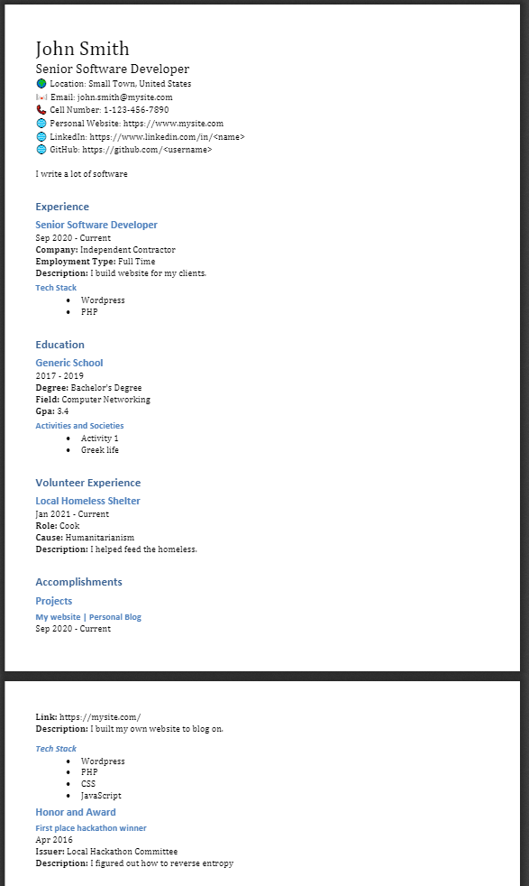

# What is this?

Dynamic Resume Generator is a tool that I built out of frustration from applying for jobs. Some things that I've done that are super relevant to the job I am applying for right now will be completely irrelevant to the next job. Rather than manually recreating a new resume for every single job posting (and having to deal with the subsequent clutter), I put all of my experience, awards, projects etc. into a single JSON file and run a script to generate a topical resume. Generated resumes are located in:

```
generated_applications > company name > job name
```

# Requirements

It uses `python-docx` to create the files. To use this tool you must have Microsoft Office installed. All instances of Microsoft Word close when this application runs, so make sure you have saved any unsaved documents.

# Example


